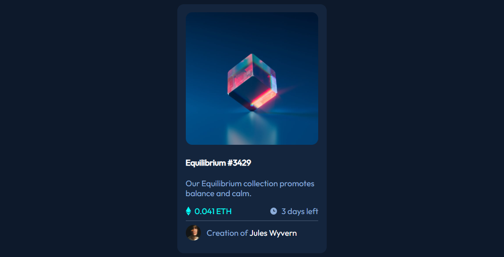

# Frontend Mentor - NFT preview card component solution

This is a solution to the [NFT preview card component challenge on Frontend Mentor](https://www.frontendmentor.io/challenges/nft-preview-card-component-SbdUL_w0U). Frontend Mentor challenges help you improve your coding skills by building realistic projects. 

## Table of contents

- [Overview](#overview)
  - [The challenge](#the-challenge)
  - [Screenshot](#screenshot)
  - [Links](#links)
- [My process](#my-process)
  - [Built with](#built-with)
  - [What I learned](#what-i-learned) 
  - [Useful resources](#useful-resources)
- [Author](#author) 

**Note: Delete this note and update the table of contents based on what sections you keep.**

## Overview

### The challenge

Users should be able to:

- View the optimal layout depending on their device's screen size
- See hover states for interactive elements

### Screenshot



### Links

- Solution URL: [text](link)
- Live Site URL: [https://asep19.github.io/nft-preview-card-component/](https://asep19.github.io/nft-preview-card-component/)

## My process

### Built with

- Semantic HTML5 markup
- Sass  
- Flexbox
- CSS Grid
- Mobile-first workflow 
 

### What I learned 
 
```css
.card__img .card__hidden {
  opacity: 1;
}
```    

### Useful resources

- [devdocs.io](https://devdocs.io) - This helped me for see css documentation. 
- [https://stackoverflow.com/questions/5210033/using-only-css-show-div-on-hover-over-another-element](https://stackoverflow.com/questions/5210033/using-only-css-show-div-on-hover-over-another-element)
 

## Author

- Website - [Asep Rendi](https://asep19.github.io)
- Frontend Mentor - [@asep19](https://www.frontendmentor.io/profile/asep19) 
 
